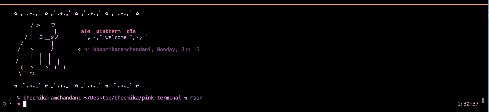

# pinkterm ♡



A cute pink-themed setup for Terminal.app on macOS — pastel + hot pink palette,
kawaii two-line prompt, ASCII welcome banner.

---

## What got built

Everything lives in `~/.pinkterm/` and is sourced from a single line appended to
`~/.zshrc`. Nothing else in your shell setup was touched.

```
~/.pinkterm/
├── init.zsh                  # entry point — sourced from .zshrc
├── prompt.zsh                # kawaii two-line PS1 with git branch
├── banner.zsh                # ASCII cat banner ("pinkterm_banner" function)
├── colors.zsh                # pink ls/grep/less colors
├── install-theme.swift       # writes the Pinkterm profile into Terminal.app
└── install-theme.applescript # earlier attempt (kept for reference; superseded)
```

And in `~/.zshrc`, three new lines wedged in at the bottom:

```zsh
# >>> pinkterm >>>
[ -f "$HOME/.pinkterm/init.zsh" ] && source "$HOME/.pinkterm/init.zsh"
# <<< pinkterm <<<
```

---

## How each piece works

### 1. The Terminal.app profile (the "background and ANSI colors")

This is the hardest part. Terminal.app stores profiles in
`~/Library/Preferences/com.apple.Terminal.plist` under the `Window Settings`
key — a dictionary mapping profile-name → dict-of-settings. Each color
(`BackgroundColor`, `ANSIRedColor`, etc.) is stored as an **archived
`NSColor` object** — i.e. binary data produced by Apple's
`NSKeyedArchiver`, not something you can write by hand.

So `install-theme.swift` does this:

1. For each color, build an `NSColor` in the sRGB colorspace.
2. Serialize it with `NSKeyedArchiver.archivedData(...)` → `Data`.
3. Do the same for the font (`NSFont(name: "Menlo", size: 14)`).
4. Assemble a `[String: Any]` dictionary with all 16 ANSI colors, background,
   text, bold text, cursor, selection, font, column/row counts, etc.
5. Open `UserDefaults(suiteName: "com.apple.Terminal")` and merge this dict
   into `Window Settings` under the key `"Pinkterm"`.
6. Set `"Default Window Settings"` and `"Startup Window Settings"` to
   `"Pinkterm"` so new windows pick it up.

Then `killall cfprefsd` so macOS's preferences daemon drops its cache and the
next Terminal launch reads the fresh plist.

The palette I chose (dark plum background, soft pink text, hot pink cursor,
mint/lavender/peach accents) is defined as plain RGB triples at the top of the
Swift file — easy to tweak.

### 2. The zsh prompt (`prompt.zsh`)

A two-line `PROMPT` using zsh's built-in `%F{N}...%f` syntax for foreground
colors (N = 0-255 from the xterm 256-color palette):

```
╭─ ♡ bhoomika  ~/n8n  ✿ main
╰─❤ ‎
```

- `╭─` `╰─` brackets in pastel (color 219)
- `♡` cream pink (225)
- Username pastel pink (218)
- Path bright pink (213)
- Git branch via zsh's `vcs_info` module in lavender (183) — only shows in a
  git repo, no perf hit elsewhere
- Final `❤` in vivid hot pink (205)
- Right-side prompt (`RPROMPT`) shows the current time in soft pink

`vcs_info` is the standard zsh way to get the current branch; `precmd_functions`
runs it once per command so the branch updates as you `cd` around.

### 3. The banner (`banner.zsh`)

A function `pinkterm_banner` that prints an ASCII cat surrounded by `✿ ｡ﾟ.✦.｡ﾟ`
sparkle borders, plus a "hi {username}, {day}" line. It uses raw ANSI escapes
(`\e[38;5;Nm`) rather than zsh `%F{N}` because we want it to work even outside
the prompt context.

`init.zsh` calls it once per top-level interactive shell — guarded by an env
var (`PINKTERM_BANNER_SHOWN`) so it doesn't re-fire if you nest `zsh` inside
`zsh`. Type `pinkterm` to reprint it any time.

### 4. The colors (`colors.zsh`)

- `LSCOLORS` — BSD `ls` color codes (macOS uses BSD `ls`, not GNU). It's a
  cursed 11-letter string mapping file types to colors. I picked magenta-ish
  letters for directories and symlinks.
- `LS_COLORS` — for GNU `ls` if you ever `brew install coreutils`.
- `GREP_COLORS` — so `grep --color` matches show in hot pink.

---

## Problems I hit (and what I learned)

### Problem 1: AppleScript couldn't set ANSI colors

My first attempt was a pure AppleScript installer
(`install-theme.applescript`). It looked clean — `tell application "Terminal"
to set ansi red color of settings set "Pinkterm" to {...}`. But on running:

```
script error: A identifier can't go after this identifier. (-2740)
```

at the line `set ansi black color of target to ...`.

It turns out **Terminal.app's AppleScript dictionary doesn't expose ANSI
colors at all**. You can script `background color`, `normal text color`,
`bold text color`, `cursor color`, and a handful of font/window properties —
but not the 16-color palette, even though those colors absolutely exist in
the plist. So the only way to set them is to write to the plist directly.

I also discovered along the way that:
- `selection color` isn't a scriptable property either (older guides say it
  is — they're wrong on current macOS).
- The font property is called `font` (not `font name`).
- Font size is `size` (not `font size`).
- `cursor shape` isn't scriptable.

### Problem 2: Writing the plist by hand is brutal

Colors in `com.apple.Terminal.plist` aren't stored as RGB strings — they're
stored as `NSKeyedArchiver`-serialized `NSColor` objects, base64-encoded
binary blobs that follow Apple's keyed archive format. You can't just
`defaults write com.apple.Terminal "Window Settings" -dict ...` with RGB
values; the OS will not interpret them as colors.

The "proper" way to generate one is to instantiate an `NSColor` and archive
it through Apple's runtime. Three ways to get to that runtime:

1. **PyObjC** — Python bindings to Cocoa. Used to ship with macOS Python.
   Checked: macOS no longer bundles Python with PyObjC by default. Skipped.
2. **AppleScriptObjC** — possible but awkward and brittle.
3. **Swift** — `/usr/bin/swift` ships with Xcode Command Line Tools (which
   you already had). Picked this.

Swift gave me direct access to `NSColor`, `NSFont`, and `NSKeyedArchiver` with
modern syntax. The whole installer ended up ~60 lines.

### Problem 3: zsh prompt rendering in piped output looked broken

When I ran `zsh -i -c 'print -P "$PROMPT"'` to sanity-check the prompt, I got
gibberish like `[3219m` instead of `[38;5;219m`. Brief panic.

Cause: with no `TERM` set (because output was being piped), zsh's `%F{N}`
prompt expansion falls back to the legacy `\e[3<color>m` format which only
covers colors 0-7. With `TERM=xterm-256color` it correctly emits
`\e[38;5;219m`. Terminal.app sets `TERM=xterm-256color` automatically, so in
real interactive use it's fine — but if you ever pipe `$PROMPT` somewhere, this
will look broken.

### Problem 4: cfprefsd caching

Even after writing the plist, Terminal.app might still see the *old*
preferences because `cfprefsd` (the macOS preferences daemon) caches them.
`killall cfprefsd` forces it to re-read on the next access. The script does
this so the new profile appears the first time you open Terminal after
install.

---

## How to tweak it later

### Change the prompt symbols or colors

Edit [`prompt.zsh`](prompt.zsh). The 256-color codes I used:
- `219` — pastel pink-purple
- `218` — light pink
- `213` — bright magenta-pink
- `205` — vivid hot pink
- `225` — cream pink
- `183` — lavender

Reload with `source ~/.zshrc` (or open a new terminal).

### Change the banner art

Edit `pinkterm_banner()` in [`banner.zsh`](banner.zsh). Each line is a
`print -r --` call. The `$p1..$p5` variables hold ANSI color escapes.

### Change the Terminal.app palette

Edit the RGB tuples in [`install-theme.swift`](install-theme.swift), then:

```sh
swift ~/.pinkterm/install-theme.swift && killall cfprefsd
```

Quit and reopen Terminal.app to see the new colors.

---

## How to uninstall

```sh
# 1. Remove the source line from ~/.zshrc (the block between the
#    "# >>> pinkterm >>>" and "# <<< pinkterm <<<" markers)
# 2. Reset Terminal.app's default profile to whatever you had before
defaults write com.apple.Terminal "Default Window Settings" -string "Pro"
defaults write com.apple.Terminal "Startup Window Settings" -string "Pro"
# 3. (Optional) Delete the Pinkterm profile entry from Window Settings via
#    Terminal → Settings → Profiles → Pinkterm → minus button
# 4. Remove the directory
rm -rf ~/.pinkterm
killall cfprefsd
```


